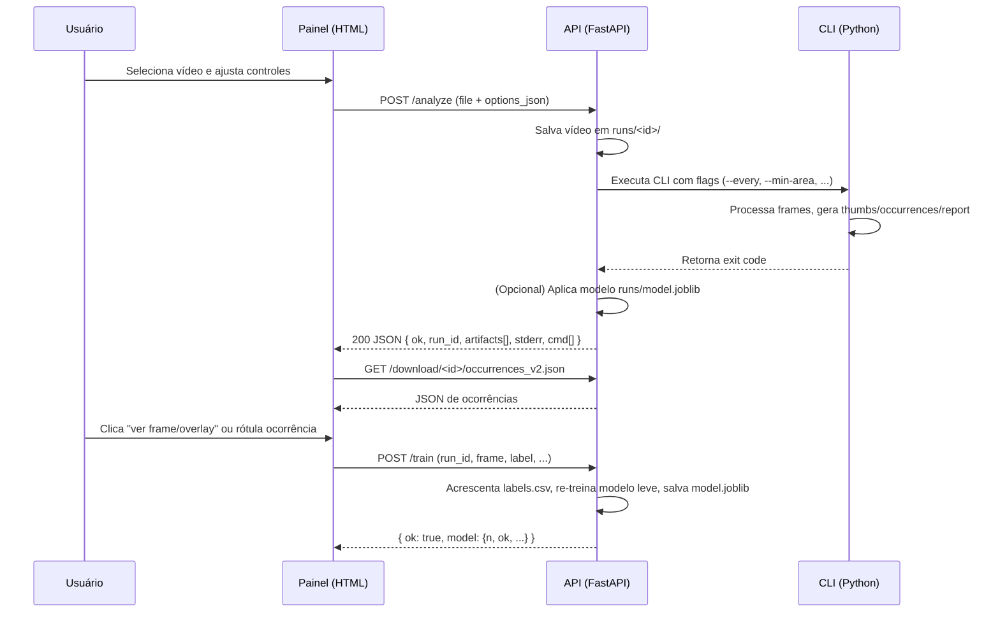

# Arquitetura & Comunicação — AgroVision

Este documento explica como **Painel (HTML)**, **API (FastAPI)** e **CLI** interagem, além do fluxo de dados e artefatos.

## Visão geral

- **Painel (veg_panel_index.html)**: app estático no navegador (JavaScript puro). Faz upload do vídeo e controles (`options_json`), mostra progresso, renderiza ocorrências, abre modal de visualização e envia rótulos para treino.
- **API (veg_product_api_v07c.py)**: recebe o upload via `POST /analyze`, salva o arquivo, **invoca o CLI** como processo separado com os flags correspondentes, coleta artefatos em `runs/<run_id>/` e retorna uma lista de artifacts/paths. Recebe rótulos em `POST /train`, re‑treina modelo leve e salva em `runs/model.joblib`. Serve arquivos em `/download/<run_id>/*`.
- **CLI (veg_product_cli.py)**: leitura do vídeo (OpenCV), cálculo de índices (VARI/NGRDI/IFV), heurísticas de máscara/área/severidade/consenso, geração de thumbs e `occurrences_v2.json`, além de `report.html` a partir do template.

## Diagrama de sequência (simplificado)

## Fluxo de artefatos

- Upload salvo em: `runs/<run_id>/<video>`
- Saídas do CLI: `runs/<run_id>/thumbs/`, `occurrences_v2.json`, `report.html`
- Logs: `runs/<run_id>/error.txt`
- Rótulos: `runs/<run_id>/labels.csv`
- Modelo: `runs/model.joblib` (global para todos os runs)

## Comunicação (detalhes)

### Painel → API
- **/analyze**: `multipart/form-data` com `file` e `options_json` (string JSON).  
  A API traduz `options_json` em flags do CLI:
  - `--every <N>`
  - `--min-area <px>`
  - `--agree-k 2|3`
  - `--min-severity <float>`
  - `--disable-soil-guard` (se `soil_guard=false`)

- **/train**: `application/json` com `{run_id, frame, time_s, type, label, bbox?, evidence?}`.  
  A API anexa a `labels.csv`, re‑treina o modelo via `model_utils.fit_and_save` e salva `runs/model.joblib`.

### API → Painel
- **Resposta de /analyze**: `{ ok, run_id, artifacts[], stderr, stdout, cmd[] }`.  
  O painel usa `artifacts` para montar os URLs de `thumbs/`, `occurrences_v2.json` e `report.html`.

### Painel → Visualização
- Para abrir imagens: o painel monta URLs baseadas em `thumbs/`:
  `GET /download/<run_id>/thumbs/frame{N}.png` e `..._overlay.png`.

## Segurança & Deploy

- CORS liberado em dev. Em produção, restrinja `allow_origins` e considere autenticação.
- **Dockerfile** e **docker-compose.yml** facilitam subir a API. O painel é estático (pode ficar no GitHub Pages/S3).
- Volume `./runs:/app/runs` persiste resultados e o `model.joblib`.

## Extensões futuras

- ROI por talhão (GeoJSON/KML), agregação temporal, exportações geoespaciais, autenticação/JWT, dashboards multi‑run.
